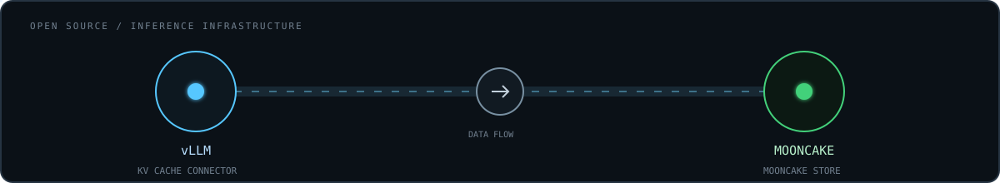

<!-- Profile README for github.com/bitborne -->

<picture>
  <source media="(prefers-color-scheme: dark)" srcset="./assets/header-dark.svg">
  <source media="(prefers-color-scheme: light)" srcset="./assets/header-light.svg">
  
</picture>

<h1 align="center">Schatten</h1>

  <strong>AI Infrastructure &amp; Systems Engineer</strong> 
  LLM serving · KV cache · high-performance storage · native systems

  <a href="https://schatten-notes.pages.dev/">notes</a>
  ·
  <a href="https://github.com/bitborne?tab=repositories">code</a>
  ·
  <a href="https://github.com/bitborne?tab=stars">reading</a>

## `open_source / inference infrastructure`

<picture>
  <source media="(prefers-color-scheme: dark)" srcset="./assets/contribution-path-dark.svg">
  <source media="(prefers-color-scheme: light)" srcset="./assets/contribution-path-light.svg">
  
</picture>

I work where **LLM serving meets high-performance storage**, connecting inference-side KV cache systems with the storage infrastructure behind them.

### vLLM · KV Cache Connector

Contributing to Mooncake integration in vLLM's KV Cache Connector, connecting inference KV cache with external storage while preserving compatibility.

[**Mooncake Store group semantics for the vLLM KV Cache Connector →**](https://github.com/vllm-project/vllm/pull/44956)

### Mooncake · Mooncake Store

Contributing to Mooncake Store, focusing on performance, correctness, and maintainability.

[PR #3222](https://github.com/kvcache-ai/Mooncake/pull/3222) · [PR #2508](https://github.com/kvcache-ai/Mooncake/pull/2508) · [PR #3328](https://github.com/kvcache-ai/Mooncake/pull/3328) · [PR #2661](https://github.com/kvcache-ai/Mooncake/pull/2661)

Additional open-source work across [RL-Kernel](https://github.com/RL-Align/RL-Kernel/pull/66), [vLLM-Omni](https://github.com/vllm-project/vllm-omni/pull/3720), and [Dragonfly](https://github.com/dragonflydb/dragonfly/pulls?q=is%3Apr+author%3Abitborne).

## `build / from first principles`

### [Kedis](https://github.com/bitborne/Kedis)

A high-performance RESP-compatible KV storage system in C, exploring asynchronous I/O, persistent storage, kernel-assisted data paths, and distributed replication.

`C` · `io_uring` · `eBPF / XDP / TC` · `RDMA` · `mmap` · `RESP` · `storage engines`

### [Android Native Memory Tracker](https://github.com/bitborne/native-memory-tracker)

A low-overhead Android native-memory tracking and analysis system, covering allocation hooks, runtime memory behavior, native binaries, and access-pattern visualization.

`C++` · `Android NDK` · `ByteHook` · `ELF / DWARF` · `PLT / GOT` · `atomics` · `page_idle`

## `engineering profile`

| Layer | Working set |
| --- | --- |
| **AI infrastructure** | vLLM, KV Cache Connector, Mooncake Store, LLM serving |
| **Systems** | high-performance storage, asynchronous I/O, distributed data paths |
| **Native runtime** | Linux and Android, memory tracking, binary and runtime analysis |
| **Core stack** | C, C++, Python, Linux, Android NDK, io_uring, eBPF, RDMA |

---

  Building the systems behind fast inference—from KV cache to storage and native runtime.

