<picture>
  <source media="(prefers-color-scheme: dark)" srcset="./assets/header-dark.svg">
  <source media="(prefers-color-scheme: light)" srcset="./assets/header-light.svg">
  
</picture>

<h1 align="center">Hi, I'm Schatten.</h1>

  I build fast systems—and care about being able to explain <em>why</em> they are fast.

  <a href="https://schatten-notes.pages.dev/">Notes</a>
  ·
  <a href="https://github.com/bitborne?tab=repositories">Repositories</a>
  ·
  <a href="https://github.com/bitborne?tab=stars">Reading list</a>

## Focus

I work close to the metal, where model serving meets memory, storage, and the Linux data path. I enjoy turning profiler traces and systems papers into software with measurable behavior.

`AI infrastructure` · `storage engines` · `systems performance` · `open source`

## Selected work

| Project | What it is |
| --- | --- |
| [**Kedis**](https://github.com/bitborne/Kedis) | A persistent, RESP-compatible KV store in C, exploring pluggable storage with io_uring, eBPF, and RDMA. |
| [**native-memory-tracker**](https://github.com/bitborne/native-memory-tracker) | An Android native-memory instrumentation project built around bytehook. |
| [**Schatten Notes**](https://github.com/bitborne/Schatten-notes) | My developer log: implementation notes, experiments, and things worth remembering. |
| [**Claude for Typora**](https://github.com/bitborne/typora-theme-claude) | A carefully finished light/dark Typora theme inspired by Claude's warm visual language. |

## Open source

I also contribute patches to performance-sensitive infrastructure projects, including [vLLM](https://github.com/vllm-project/vllm), [vLLM-Omni](https://github.com/vllm-project/vllm-omni), [Mooncake](https://github.com/kvcache-ai/Mooncake), [Dragonfly](https://github.com/dragonflydb/dragonfly), and [RL-Kernel](https://github.com/RL-Align/RL-Kernel).

## Working set

`C` · `C++` · `Python` · `Linux` · `eBPF` · `io_uring` · `RDMA` · `model serving`

---

  South China University of Technology · notes at <a href="https://schatten-notes.pages.dev/">schatten-notes.pages.dev</a>

